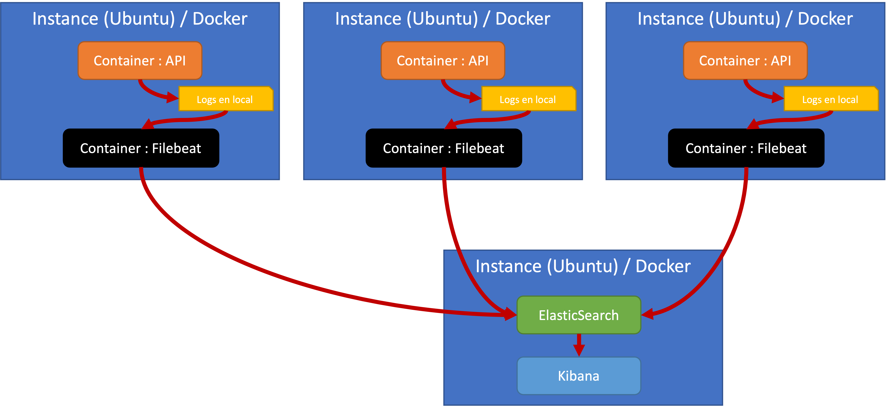
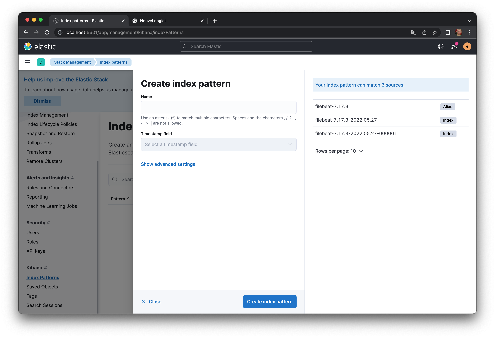
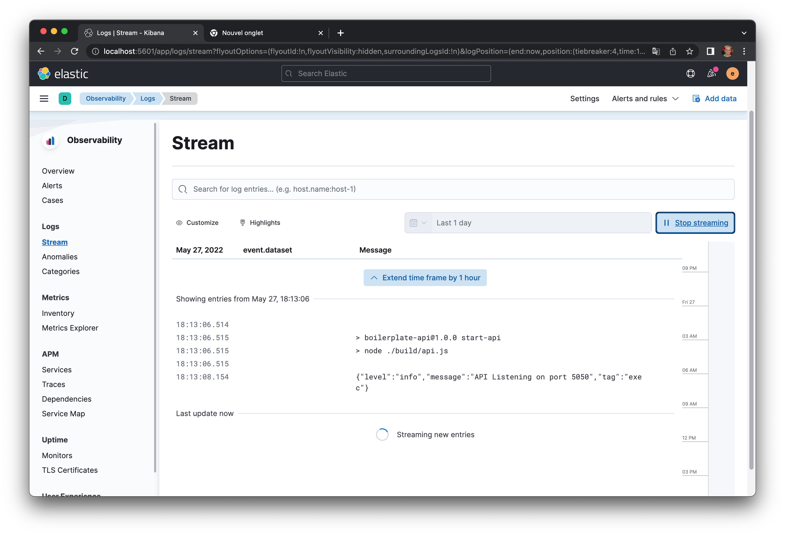

[[_TOC_]]

# Déploiement et logging

L'objectif de cet étape est de mettre en place un environnement qui s'approche a celui du déploiement, qu'on appelle `stage`.

Nous allons :
* Rédiger une fichier `docker-compose.yml` qui regroupe notre environnement, avec une bonne configuration de variables.
* Configurer facilement une base de données `stage` avec des coordonnées différentes que celles de développement.
* Ajouter des services de logging pour pouvoir observer les actions


## Créer un `Dockerfile.prod` pour l'api

On va construire notre environnement de déploiement en excluant vscode et tous les outils de développement. En effet l'objective est de livrer seulement les éléments nécessaires pour un déploiement.

On va commencer par rédiger un `Dockerfile` qui va construire une image docker avec uniquement notre API, déjà compilé.

[Dockerfile.prod](../../Dockerfile.prod)

A noter :

* Il y a deux étapes. Le premier étape va créer une image temporaires dans lequel on va executer notre script `build` qu'on avait construit dans la branche précédente.
* Dans le 2ème étape, on va juste copier les dossier build, en excluant les codes sources et les autres éléments de dev.
* On termine par :

```Dockerfile
# Dockerfile.prod


# Installer uniquement les dependences cruciels (excluant ceux pour le dev)
RUN npm install --omit=dev
# Le script pour lancer l'api
CMD npm run start-api
```

Pour le dernier, il faut bien sur ajouter à `package.json` un script qui lance l'api qui est déjà compilé :

```json
/* package.json */

 "scripts": {
    "api": "nodemon",
    "swagger": "tsoa spec-and-routes",
    "clean": "rimraf build",
    "build": "npm run clean && npm run swagger && tsc && copyfiles public/**/* build/",
    /* Ajouter un script pour lancer une appli déjà construit */
    "start-api": "node ./build/api.js"
  },

```


## Créer un `docker-compose.stage.yml` 

Nous allons créer une configuration qu'on pourrait lancer n'importe où (sans VScode). Par exemple, on pourrait cloner notre dépot git sur un serveur et juste executer docker-compose avec ce fichier, et tou devrait se lancer correctement.

```yml
# docker-compose.stage.yml

version: '3.9'

services:
  stage-dbms:
    image: mariadb
    restart: always
    ports:
      - "3310:3306"
    env_file: 
      - ./dbms/.env.stage
    command: [
      "--character-set-server=utf8mb4",
      "--collation-server=utf8mb4_unicode_ci",
    ]
    volumes:
      - ./stage/dbms/dbms-data:/var/lib/mysql
      - ./dbms/mariadb.cnf:/etc/mysql/mariadb.cnf
      # Pointer vers un dossier qui aura des scripts d'initialisation de notre base
      - ./dbms/stage-initdb.d:/docker-entrypoint-initdb.d
      # Ajouter le DDL qui va tourner en dernier
      - ./dbms/ddl/ddl.sql:/docker-entrypoint-initdb.d/999-ddl.sql
    networks:
      - api-stage-network

   

  stage-api:
    build: 
      context: ./
      dockerfile: ./Dockerfile.prod
    container_name: api
    ports:
      - "5060:5050"
    environment:
      - NODE_ENV=prod
      - PORT=5050
      - DB_HOST=stage-dbms
      - DB_USER=api-stage
      - DB_PASSWORD=api-stage-password
      - DB_DATABASE=mtdb_stage     
      - AWS_ACCESS_KEY_ID=SCWTY6B680E3QQ9WM2V5
      - AWS_SECRET_ACCESS_KEY=18856bfe-8260-4cfd-8802-389f943deccf
      - STORAGE_REGION=fr-par
      - STORAGE_ENDPOINT=https://s3.fr-par.scw.cloud
      - STORAGE_BUCKET=object-storage-playground
    networks:
      - api-stage-network
    restart: always
    depends_on:
      - stage-dbms
    logging:
      driver: "json-file"
      options:
        max-file: "5"
        max-size: "500m"

networks:
  api-stage-network:
    driver: bridge


```


A noter :
* Nous avons ajoutés des configurations pour une base de données exclusivement `stage`. Ceci pour être totalement indépendant de notre environnement dev si jamais on veut tester l'environnement sur la même machine.
    * On utilise le fichier `.env.stage` à la première initialisation de la base
    * On lance les scripts sql dans `dbms/stage-initdb.d` pour la création d'un utilisateur
    * Comme pour dev, on lance le script pour le DDL. Cette partie ne change pas.
* On a crée une entré pour l'api
    * On va construire une image docker précisé par notre `Dockerfile.prod``
    * On écoute sur un port à notre choix (mais différent à notre environnement de dev si on est sur la même machine)
    * On précise des valeurs d'environnement pour notre API en mode stage. Normalement la base, les utilisateurs, même le lieu de Objet Storage sont tous différents

Pour lancer cet environnement, il faut éxécuter le suivant :

```sh
# Dans un terminal (pas dans VSCode)

docker-compose -f docker-compose.stage.yml up
```

La configuration se lance et écoute sur le port 5060.

## Mettre à jour votre image

Si jamais vous modifiez votre code-source, on peut redéployer l'api :

```sh
# D'abord, recompiler l'image de notre service stage-api
docker-compose -f docker-compose.stage.yml build stage-api

# Ensuite activer l'image
docker-compose -f docker-compose.stage.yml pull stage-api

# Ensuite relancer le container basé sur l'image
docker-compose -f docker-compose.stage.yml up -d stage-api
```

Vous pouvez par exemple cloner ce projet sur une instance dans un service cloud. Vous avez juste à lancer `docker-compose` pour gérer votre service sur l'instance. Facile !


## Logging

Il est essentiel qu'on puisse suivre les logs générés par notre API. Bien sur, il est possible juste de se connecter à l'instance qui tourne notre API, puis :

```sh
# Afficher les logs d'un container docker
docker logs [ID OU NOM DU CONTAINER] --follow
```

Si on a l'intention d'avoir plusieurs instances de notre API, sur plusieurs instances dans le cloud, on risque d'avoir plusieurs logs à regarder si jamais il y a un incident. Il serait pratique d'avoir un point central où on peut récupérer et regarder les logs.

Pour cet exercice on va configurer un setup ou on surveille les logs générés par Docker, et les transférer vers une base centralisé (ElasticSearch).

> A noter : ElasticSearch est une base NoSQL qui est extrêmement puissant notamment dans les recherches textuelles. On va voir comment le configurer en local ici, mais je ne vous demanderai pas de le déployer dans le cloud, parce qu'il est extrêmement gourmand en ressources, et donc demanderait une instance trop cher pour un budget étudiant.

Le setup qu'on cherche est le suivant :



* Chaque container docker emet se propres logs dans un fichier sur l'instance où il tourne.
* On va déployer un autre container basé sur l'image `Filebeats` qui est un processus qui lit les fichiers logs sur la machine locale, et les renvoie vers une serveur centralisé, dans notre cas une autre instance qui tourne ElasticSearch
* Elasticsearch intègre et stocke les logs
* Kibana est une interface utilisateur qui permet de visualiser les logs et effectuer des requêtes


### Filebeats

Filebeats va tourner sur chaque instance et surveiller les logs. On ajoute à notre docker-compose l'entrée suivante :

```yml
  filebeat:
    image: docker.elastic.co/beats/filebeat:7.17.3
    container_name: filebeat
    user: root
    environment:
      - setup.kibana.host=kibana:5601 
      # On précise qu'on envoie les données vers le service "elasticsearch"
      - output.elasticsearch.hosts=["elasticsearch:9200"]
    volumes:
      # Ici, on précise l'endroit d'un fichier de configuration
      - ./logging/filebeat/filebeat.docker.yml:/usr/share/filebeat/filebeat.yml:ro
      # C'est l'emplacement des logs docker sur une installation docker classic
      - /var/lib/docker/containers:/var/lib/docker/containers:ro
      - /var/run/docker.sock:/var/run/docker.sock:ro
    depends_on:
      - elasticsearch
    networks:
      # Le réseau pour les logs
      - api-stage-logging

networks:
  api-stage-network:
    driver: bridge
  # **** ATTENTION : on ajoute un 2ème réséau pour l'envoie des logs. Ceci pour ne pas perturber le réseau principal entre l'api et la dbms
  api-stage-logging:
    driver: bridge

```

Il faut donc créer le fichier de configuration filebeats à [`logging/filebeat/filebeat.docker.yml`](../../logging/filebeat/filebeat.docker.yml).

Filebeats va envoyer TOUS les logs sortant de docker à ElasticSearch, et ceci peut-être un peu beucoup. 

Nous allons donc lui dire d'ignorer les logs sortant des containers qui nous intéressent pas.

Dans `logging/filebeat/filebeat.docker.yml`, on précise le tag à utiliser :

```yml
# logging/filebeat/filebeat.docker.yml

- drop_event:
    when:
      not:
        has_fields: ['fields.logging_container']
```

En gros, si on n'a pas de tag 'loggin_container' sur le container, il faut ignorer ses logs.

Ensuite, on va modifier notre `docker-compose.stage.yml` en ajoutant les tags sur les containers qui nous intéressent :

```yml
# docker-compose.stage.yml 

  stage-api:
    build: 
      context: ./
      dockerfile: ./Dockerfile.prod
    ...
    # Ajoutez ces lignes !
    labels:
      co.elastic.logs/processors.1.add_fields.fields.logging_container: "stage-api"
```

Filebeats va désormais ignorer tous les containers sauf stage-api.

Il faut arrêter votre environnement avec `docker-compose -f docker-compose.stage.ym down` puis le relancer pour que les modifications soient prises en compte.


### Elasticsearch et Kibana

On ajoute des services elasticsearch et kibana :

```yml
# docker-compose.stage.yml 

  elasticsearch:
    image: docker.elastic.co/elasticsearch/elasticsearch:7.17.3
    container_name: elasticsearch
    environment:
      - discovery.type=single-node
      - bootstrap.memory_lock=true
      - "ES_JAVA_OPTS=-Xms512m -Xmx512m"
      # Attention au mot de passe. Le nom d'utilisateur est "elastic"
      - ELASTIC_PASSWORD=changeme
      - xpack.security.enabled=true
    volumes:
      # Préciser le lieu de stockage de nos données (comme pour la base de données)
      - ./stage/logs/elasticsearch_data:/usr/share/elasticsearch/data
    ports:
      - 9200:9200
    networks:
      - api-stage-logging

  kibana:
    image: docker.elastic.co/kibana/kibana:7.17.3
    container_name: kibana
    environment:
      - ELASTICSEARCH_USERNAME=elastic
      - ELASTICSEARCH_PASSWORD=changeme
      - ELASTICSEARCH_URL=http://elasticsearch:9200
      - ELASTICSEARCH_HOSTS=http://elasticsearch:9200
    ports:
      - 5601:5601
    depends_on:
      - elasticsearch
    networks:
      - api-stage-logging

```

On relance notre service avec :

```sh
# Dans un terminal hors VSCode

docker-compose -f docker-compose.stage.ym up
```

Attention, elastic-search et Kibana prennent du temps à se lancer en fonction de votre machine.

Kibana écoute sur le port 5601, vous pouvez l'accéder à [http://localhost:5601/app](http://localhost:5601/app). 

* Nom d'utilisateur: elastic
* Mot de passe : changeme

Dans le menu gauche, naviguez dans Management, Stack Management, Kibana, Index Patterns.

Cliquez sur "Create Index Pattern". Si tout va bien vous verrez déjà des sources `filebeat-7.17.3-*` :



Vous pouvez tout prendre en entrant le nom `filebeat-7.17.3-*`.

Ensuite vous précisez le champ `@timestamp` comme emprunt de temps. Cliquez sur "Create index pattern"

Dans le menu gauche, vous naviguez dans Observability, Logs pour voir les logs générés par votre API. Vous pouvez les suivre en temps réel en cliquant sur "Stream live" :



Tester quelques requêtes avec Postman (attention, le port est 5060 !!). Vous verrez apparaître les logs dans Kibana !

> Aller plus loin : Kibana est très puissant et peut parser nos données et créer des tableaux de bord qui aggrègent de données sortant de nos logs. Ex. dans le menu gauche, vous pouvez sélectionner Dashboard, puis commencer à créer des Dashboards avec des requêtes sur n'importe quel champ entrant.


# Stratégie de logs dans notre API

Pour que ElasticSearch et Kibana soient utile, il faut qu'on leur passe des logs qui ont du sens et qui sont dans un format adapté pour l'analyse (par exemple, .json).

Nous allons implémenter une stratégie de log qui :
* enregistre chaque requête auprès de notre base avec toutes les infos pertinentes, via un middleware
* la possibilité d'ajouter d'autres sortes de logs ponctuels dans notre code, via des fonctions utilitaires


## Middleware de logging

On créer un middleware qui s'occupe de la création de logs avec chaque requête, à l'aide du package [morgan](https://www.npmjs.com/package/morgan).

Notre middleware : [/src/classes/Logging/LoggingMiddleware.ts](../../src/classes/Logging/LoggingMiddleware.ts)

Le middleware est assez simple. Si on est en mode production, on va sortir les champs en format json, sinon juste sur une ligne (qui nous aide pendant le développement.)

On ajoute ce middleware dans [api.ts](../../src/api.ts), avant les routes :

```ts
// api.ts

...
// Utiliser un middleware pour créer des logs
app.use(requestLogMiddleware('req'));

// Les routes de tsoa
RegisterRoutes(app);

...
```

## Outil de logging

On crée des fonctions qui permet de sortir des logs dans un bon format avec toutes les informations nécessaires.

Outil [src/classes/Logging/Log.ts](../../src/classes/Logging/Log.ts).

On utilise le package [winston](https://github.com/winstonjs/winston) pour gérer les flux des logs (entre json ou text simple, selon l'envirronnement).

Puis on définit un ensemble de fonctions qu'on peut utiliser dans notre code. L'idée est de ne plus utiliser `console.log(...)` en faveur de nos fonctions, pour assurer un bon format à tout moment.

A l'arrivée dans ElasticSearch / Kibana, on pourrait facilement détecter des erreurs ou des messages d'info, ou bien les logs concernant un certain module (via les tags).

Un exemple de l'utilisation est dans notre [middleware de gestion d'erreur](../../src/middleware/error-handler.ts) : 

```ts
// src/middleware/error-handler.ts

  ...
  LogError(error.message, err.json);
  
  res.status(err.code).json(err.json);   
  
```

Quand on rencontre une erreur, elle sera bien enregistré avec des informations supplémentaires.